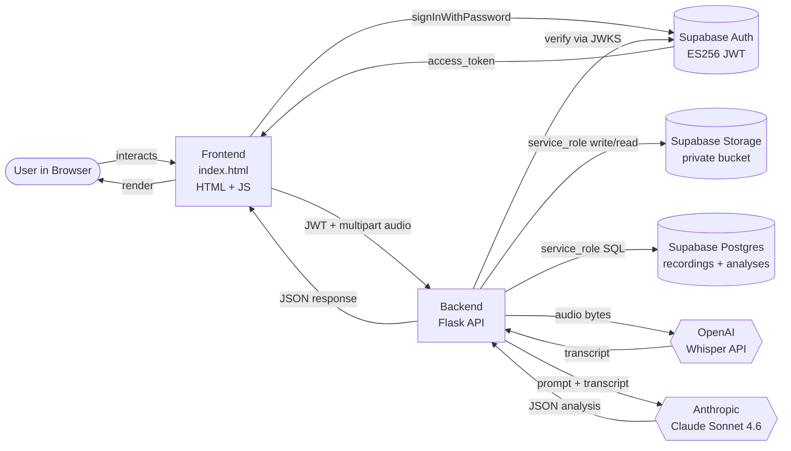
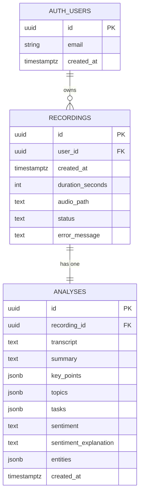
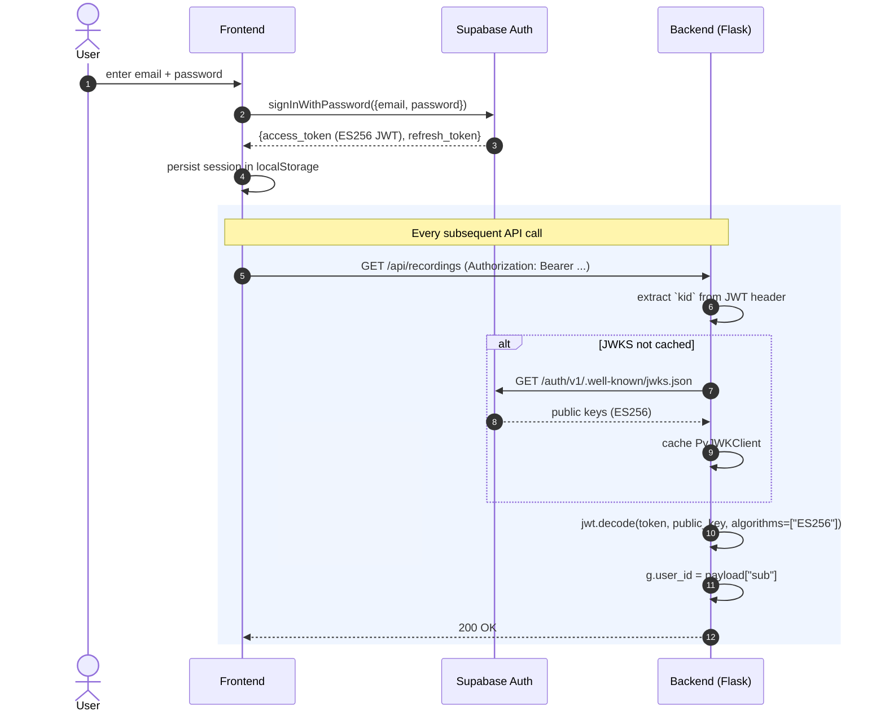
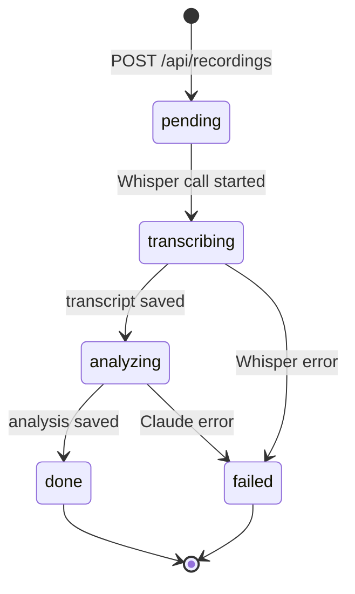

# Call Analysis · ניתוח שיחות

> A Hebrew, right-to-left web application for recording voice calls, automatically transcribing them with OpenAI Whisper, and extracting structured semantic insights — summary, topics, action items, sentiment, and named entities — with Anthropic's Claude.

---

## Table of Contents

- [Features](#features)
- [Architecture](#architecture)
- [Tech Stack](#tech-stack)
- [Database Schema](#database-schema)
- [Recording Lifecycle](#recording-lifecycle)
- [Authentication Flow](#authentication-flow)
- [Recording Status State Machine](#recording-status-state-machine)
- [Project Structure](#project-structure)
- [Prerequisites](#prerequisites)
- [Setup](#setup)
  - [1. Supabase Project](#1-supabase-project)
  - [2. Backend](#2-backend)
  - [3. Frontend](#3-frontend)
- [Environment Variables](#environment-variables)
- [API Reference](#api-reference)
- [Running Locally](#running-locally)
- [Deployment to Railway](#deployment-to-railway)
- [Design Decisions](#design-decisions)
- [Troubleshooting](#troubleshooting)
- [License](#license)

---

## Features

- 🎤 **Browser-based voice recording** — `MediaRecorder` API records WebM/Opus directly from the user's microphone, with a live timer and visual recording indicator.
- 📝 **Hebrew transcription** — OpenAI Whisper API with `language="he"` for accurate Hebrew speech-to-text.
- 🧠 **Structured AI analysis** with Claude Sonnet 4.6, returning a strict JSON schema:
  - Concise **summary** + 3-5 **key points**
  - **Topic extraction** as tag chips
  - **Action items** with owner + due date
  - **Sentiment** classification (positive / negative / neutral / mixed) with explanation
  - **Named entity recognition** grouped into people / organizations / dates / places
- 🔐 **Modern authentication** — Supabase Auth (Email/Password) with ES256 asymmetric JWTs validated server-side via JWKS.
- 📚 **Per-user history** — every recording is scoped to the authenticated user via Row-Level Security.
- 🪶 **Cost-efficient** — Claude prompt caching on the static system prompt cuts ~90% off the cached portion of every analysis call.
- 🇮🇱 **Hebrew RTL UI** — fully right-to-left layout with the Heebo typeface.

---

## Architecture

High-level component diagram of how the browser, backend, and external services interact:



---

## Tech Stack

| Layer | Technology |
|---|---|
| **Frontend** | Single-file HTML + Vanilla JS, Heebo font, `@supabase/supabase-js` from ESM CDN |
| **Backend** | Python 3.12, Flask 3, Flask-CORS, gunicorn |
| **Database** | Supabase (managed Postgres 15+) |
| **Auth** | Supabase Auth — Email/Password, ES256 JWT, JWKS validation via PyJWT |
| **Storage** | Supabase Storage — private bucket, signed URLs |
| **Speech-to-Text** | OpenAI Whisper API (`whisper-1`, `language="he"`) |
| **LLM** | Anthropic Claude Sonnet 4.6, structured outputs + prompt caching |
| **Hosting (backend)** | Railway (gunicorn via `Procfile`) |
| **Hosting (frontend)** | Static — any CDN (Vercel, Netlify, Railway static, GitHub Pages) |

---

## Database Schema

Two tables in the `public` schema, both with Row-Level Security enabled. The `analyses` row is created lazily once transcription completes.



The full DDL with RLS policies and the private storage bucket lives in [`backend/supabase/migrations/`](backend/supabase/migrations/).

**Key constraints:**
- `recordings.user_id` references `auth.users(id)` with `ON DELETE CASCADE`.
- `analyses.recording_id` is `UNIQUE` and references `recordings(id)` with cascade — this gives a strict 1-to-1 relationship.
- `recordings.status` is a `CHECK` constraint over `pending | transcribing | analyzing | done | failed`.
- `analyses.sentiment` is a `CHECK` constraint over `positive | negative | neutral | mixed`.

---

## Recording Lifecycle

The end-to-end flow from a click in the browser to a rendered analysis:

```mermaid
sequenceDiagram
    autonumber
    actor U as User
    participant FE as Frontend (browser)
    participant BE as Backend (Flask)
    participant ST as Supabase Storage
    participant DB as Supabase Postgres
    participant W as OpenAI Whisper
    participant C as Anthropic Claude

    U->>FE: Click record button
    FE->>FE: getUserMedia() → MediaRecorder.start()
    U->>FE: Click stop
    FE->>FE: Build Blob (audio/webm; opus)
    FE->>BE: POST /api/recordings (multipart + Bearer JWT)
    BE->>BE: @require_auth → JWKS verify
    BE->>ST: upload {user_id}/{rec_id}.webm
    BE->>DB: INSERT recording (status=pending)

    BE->>DB: UPDATE status=transcribing
    BE->>W: transcribe(audio, language="he")
    W-->>BE: transcript text
    BE->>DB: INSERT analyses (transcript)

    BE->>DB: UPDATE status=analyzing
    BE->>C: messages.create(prompt + transcript, JSON schema)
    C-->>BE: {summary, key_points, topics, tasks, sentiment, entities}
    BE->>DB: UPDATE analyses (full result)
    BE->>DB: UPDATE status=done

    BE-->>FE: 201 {recording_id, status:"done"}
    FE->>BE: GET /api/recordings/{id}
    BE-->>FE: 200 {transcript, analysis, audio_url}
    FE->>U: Render transcript + 5 analysis tabs + history
```

> **Note:** Processing is **synchronous** in this MVP — a single HTTP request blocks until Whisper and Claude finish (~10–20 seconds for a one-minute recording). For production, this should be moved to a background worker (Celery + Redis, or Supabase Edge Functions).

---

## Authentication Flow

The frontend authenticates against Supabase Auth, then attaches the issued JWT to every backend request. The backend verifies the signature using the project's public keys (JWKS).



**Why JWKS instead of a shared secret?** New Supabase projects (created since late 2025) sign tokens with asymmetric keys (ES256). There is no shared `JWT_SECRET` to store in `.env` — the backend fetches the project's public key from the well-known endpoint and caches it. This is more secure (no key rotation drift, no shared secret to leak) and is the modern recommendation.

---

## Recording Status State Machine

Each recording row carries a `status` field that progresses through this finite-state machine. All transitions happen inside `process_recording()` in [`backend/app.py`](backend/app.py):



When `status = failed`, the `error_message` column carries a truncated description for debugging. The frontend can poll `GET /api/recordings/<id>/status` if you switch to async processing.

---

## Project Structure

```
PSY/
├── README.md                       ← you are here
├── .gitignore
│
├── frontend/
│   └── index.html                  ← single-file Hebrew RTL app
│                                     (CSS + ES module JS embedded)
│
└── backend/
    ├── app.py                      ← Flask routes + processing pipeline
    ├── services/
    │   ├── auth.py                 ← @require_auth — JWKS verify
    │   ├── supabase_client.py      ← service-role client singleton
    │   ├── transcription.py        ← Whisper wrapper
    │   └── analysis.py             ← Claude wrapper + prompt caching
    │                                 + JSON schema
    ├── supabase/
    │   ├── config.toml             ← Supabase CLI config
    │   └── migrations/
    │       └── *_initial_schema.sql ← DDL + RLS + bucket
    ├── test_connection.py          ← E2E connectivity check
    ├── requirements.txt
    ├── runtime.txt                 ← python-3.12 (Railway)
    ├── Procfile                    ← gunicorn entry (Railway)
    ├── .env.example
    └── .gitignore
```

---

## Prerequisites

| Tool | Version | Purpose |
|---|---|---|
| Python | 3.12+ | Backend runtime |
| Supabase account | (free tier OK) | DB + Auth + Storage |
| Supabase CLI | 2.79+ | Run migrations |
| OpenAI API key | (any) | Whisper transcription |
| Anthropic API key | (any) | Claude analysis |
| A modern browser | Chrome/Edge/Firefox | `MediaRecorder` + `getUserMedia` |
| Railway account | (optional, for deploy) | Hosting the backend |

---

## Setup

### 1. Supabase Project

```bash
# Login to Supabase CLI (opens browser)
supabase login

# Create a new project (interactive)
supabase orgs create "Your Org Name"   # if you don't have one
supabase projects create your-app-name \
  --org-id <org-id> \
  --region eu-central-1 \
  --db-password "$(python -c 'import secrets; print(secrets.token_urlsafe(24))')"

# Link the local repo to the new remote project
cd backend
SUPABASE_DB_PASSWORD=<your-password> supabase link --project-ref <ref>

# Push the schema migration (creates tables, RLS, storage bucket)
SUPABASE_DB_PASSWORD=<your-password> supabase db push --yes
```

Then in the Supabase Dashboard:
- **Authentication > Providers > Email** — make sure Email is enabled
- **Authentication > Providers > Email** — turn off "Confirm email" for local dev (turn back on for production)

### 2. Backend

```bash
cd backend
python -m venv venv
source venv/Scripts/activate          # Windows bash
# or: source venv/bin/activate        # macOS/Linux

pip install -r requirements.txt

cp .env.example .env
# Then fill .env with values from Supabase Dashboard + your OpenAI/Anthropic keys
```

Verify everything is wired up:

```bash
python test_connection.py
```

You should see five `OK` lines.

### 3. Frontend

The frontend has no build step. Edit two constants near the bottom of `frontend/index.html`:

```js
const SUPABASE_URL = 'https://<your-ref>.supabase.co'
const SUPABASE_KEY = 'sb_publishable_...'   // from Dashboard > Project Settings > API
```

That's it. Serve it as static files (see [Running Locally](#running-locally) below).

---

## Environment Variables

All backend configuration is in `backend/.env` (see [`backend/.env.example`](backend/.env.example) for the template). **Never commit `.env`** — it's gitignored.

| Variable | Required | Description |
|---|:---:|---|
| `SUPABASE_PROJECT_REF` | ✅ | Project reference, e.g. `gykjrdgjytphuchnsbcy`. Used to build the JWKS URL. |
| `SUPABASE_URL` | ✅ | `https://<ref>.supabase.co` — used by the Supabase Python client. |
| `SUPABASE_SERVICE_KEY` | ✅ | `service_role` key — the **only** key the backend needs. Bypasses RLS. **Server-side only — never ship to browser.** |
| `SUPABASE_ANON_KEY` | – | Legacy anon key (informational; only the frontend uses it). |
| `SUPABASE_PUBLISHABLE_KEY` | – | Modern publishable key for the frontend. |
| `OPENAI_API_KEY` | ✅ | For Whisper transcription. |
| `ANTHROPIC_API_KEY` | ✅ | For Claude analysis. |
| `FRONTEND_ORIGIN` | ✅ | CORS allowlist for the frontend, e.g. `http://localhost:5500`. |
| `STORAGE_BUCKET` | – | Defaults to `recordings`. Override only if you renamed the bucket. |

---

## API Reference

All endpoints require a valid Supabase JWT in `Authorization: Bearer <token>` (except `/api/health`).

| Method | Path | Description | Returns |
|---|---|---|---|
| `GET` | `/api/health` | Liveness check (no auth) | `{"ok": true}` |
| `POST` | `/api/recordings` | Upload audio (`multipart/form-data` with field `file`). Optional `duration_seconds` form field. **Synchronous** — blocks until processing finishes. | `201 {"recording_id", "status":"done"}` |
| `GET` | `/api/recordings` | List the authenticated user's recordings, newest first (max 100). | `200 {"items":[{"id","created_at","duration_seconds","status","summary"}]}` |
| `GET` | `/api/recordings/<id>` | Fetch a single recording with its full transcript, analysis, and a 10-minute signed audio URL. | `200 {"id","status","analysis":{...},"audio_url"}` |
| `GET` | `/api/recordings/<id>/status` | Poll status only (cheap; useful if you switch to async). | `200 {"status","error_message"}` |

**Errors** are JSON:
```json
{"error": "internal_error", "type": "ValueError", "message": "..."}
```

---

## Running Locally

You need **two** servers running side-by-side.

**Terminal 1 — backend (port 5000):**

```bash
cd backend
source venv/Scripts/activate
PYTHONIOENCODING=utf-8 flask --app app run --port 5000
```

**Terminal 2 — frontend static server (port 5500):**

```bash
python -m http.server 5500 --directory frontend
```

Then open <http://localhost:5500> in your browser, log in with a user you've created in the Supabase Dashboard (or the signup form), and click the green record button.

> **Important:** Don't open `frontend/index.html` directly via `file://` — `getUserMedia` and `fetch` will both reject the origin. You must serve it over HTTP.

---

## Deployment to Railway

The backend is Railway-ready out of the box:

```bash
cd backend
railway login
railway init                                  # creates a project + service
# Add all variables from your .env in Variables tab (Dashboard or `railway variables`)
railway up                                    # deploys via Procfile
railway domain                                # generates a public URL
```

The `Procfile` runs `gunicorn app:app --bind 0.0.0.0:$PORT --workers 2 --timeout 120` — the long timeout accommodates the synchronous Whisper + Claude pipeline.

After deploy:
1. Update `FRONTEND_ORIGIN` in Railway variables to the production frontend URL.
2. Update `SUPABASE_URL` / `SUPABASE_KEY` in `frontend/index.html` if needed.
3. Host the frontend separately — Vercel and Netlify give free CDN-backed static hosting; Railway also supports static services.

> Supabase is **not** hosted on Railway — it remains its own managed service at supabase.com.

---

## Design Decisions

A few non-obvious choices, with rationale:

- **Synchronous processing in MVP** — `POST /api/recordings` blocks until Claude returns. Simpler than a job queue, fine for ≤2-minute recordings. Move to Celery + Redis (Railway has a Redis template) when you outgrow it.

- **JWKS over shared JWT secret** — new Supabase projects use ES256 asymmetric signing. The backend caches the public keys via `PyJWKClient` and verifies signatures locally. No `JWT_SECRET` to store, leak, or rotate.

- **Service-role key in the backend** — the backend bypasses RLS and uses the service role for storage writes and DB queries scoped by `user_id` extracted from the verified JWT. RLS policies remain enabled as defense-in-depth.

- **Prompt caching on Claude** — the system prompt (analysis instructions + JSON schema) is wrapped in `cache_control: {type: "ephemeral"}`. The transcript varies per request, so only the small variable suffix is billed at full rate.

- **Strict JSON schema for Claude output** — analysis is requested via `output_config.format = json_schema`, so Claude is constrained to return parseable JSON in the exact shape the database and frontend expect. No regex/string-parsing fragility.

- **Single-file frontend** — no bundler, no node_modules. The Supabase JS SDK is loaded as an ES module from `esm.sh`. Trades CDN dependency for zero-build deploys.

- **Storage bucket is private** — the backend generates short-lived signed URLs (10 minutes) on each fetch. Audio is never accessible without a fresh authenticated request.

---

## Troubleshooting

| Symptom | Likely Cause | Fix |
|---|---|---|
| `500 Internal Server Error` on every API call | Multiple zombie Flask processes on port 5000 (Windows) | `taskkill //F //IM python.exe`, then restart cleanly |
| `KeyError: 0` on `analyses[0]` | Code expects list but Supabase returns a dict for 1-to-1 joins | Use `if isinstance(a, list)` guard |
| `failed to connect to postgres` from `supabase migration list --local` | Local Supabase stack (Docker) not running | This command needs `supabase start` first; for remote-only workflow, use `supabase migration list` without `--local` |
| `Cannot find project ref. Have you run supabase link?` | CLI not linked to the remote project | `cd backend && supabase link --project-ref <ref>` |
| `MediaRecorder is not defined` in browser | Insecure origin (`file://`) | Serve via `http://localhost:...`, not file path |
| Microphone permission denied | Browser security setting | Click the lock icon next to URL → Site settings → Allow microphone |
| Hebrew characters logged as `\u05de\u05e7...` | Python default cp1252 console on Windows | `set PYTHONIOENCODING=utf-8` (already in our run command) |
| `cache_read_input_tokens: 0` on every Claude call | Something volatile is changing in the system prompt | Check for timestamps/UUIDs interpolated into the prompt; see the [prompt caching guide](https://platform.claude.com/docs/en/build-with-claude/prompt-caching) |

---

## License

This project does not yet specify a license. All rights reserved by the author until one is added. Add a `LICENSE` file (MIT, Apache-2.0, etc.) to make it open source.
